<div align="center">

<br />


# 💸 Cashflow

### *Membantu setiap rupiah memiliki tujuan.*

<br />

[](https://swift.org)
[](https://developer.apple.com/ios/)
[](https://developer.apple.com/xcode/swiftui/)
[](https://developer.apple.com/documentation/coredata)
[](https://developer.apple.com/documentation/widgetkit)

<br />

</div>

---

## What is Cashflow?

**Cashflow** is a native iOS personal finance app built entirely in **SwiftUI** — designed for people who want visibility into their money without the guilt trip.

Most finance apps feel like spreadsheets in disguise. Cashflow is different. It's calm, fast, and intelligent. Built around a single question: *"Given how I spend right now — what happens next?"*

> *"I don't need an app that tells me to save. I need an app that shows me where I stand, and what happens if I keep going like this."*
>
> — Primary Persona, The Builder

---

## Feature Set

| # | Feature | Status |
|---|---------|--------|
| 01 | **Design System** — Custom tokens, typography, warm color palette | ✅ Shipped |
| 02 | **Auth & Onboarding** — Face ID / passcode lock + 3-screen onboarding | ✅ Shipped |
| 03 | **Dashboard** — Saldo overview, AI quick insight card, recent transactions | ✅ Shipped |
| 04 | **Transactions** — Full CRUD, custom categories, income/expense toggle | ✅ Shipped |
| 05 | **Budget Tracker** — Per-category budget with real-time progress bars | ✅ Shipped |
| 06 | **Reports** — Monthly breakdown, category analysis, trend comparison | ✅ Shipped |
| 07 | **AI Advisor** — Rule-based insights + spending pattern detection via Sumopod API | ✅ Shipped |
| 08 | **Bills Reminder** — Recurring bill tracking + local push notifications | ✅ Shipped |
| 09 | **OCR Scanner** — Receipt scan via Vision framework, auto-extract amount & date | ✅ Shipped |
| 10 | **iOS Widget** — Home Screen widget for balance, budget & bills via WidgetKit | ✅ Shipped |

---

## App Previews

<table align="center">
  <tr>
    <td align="center" width="25%">
      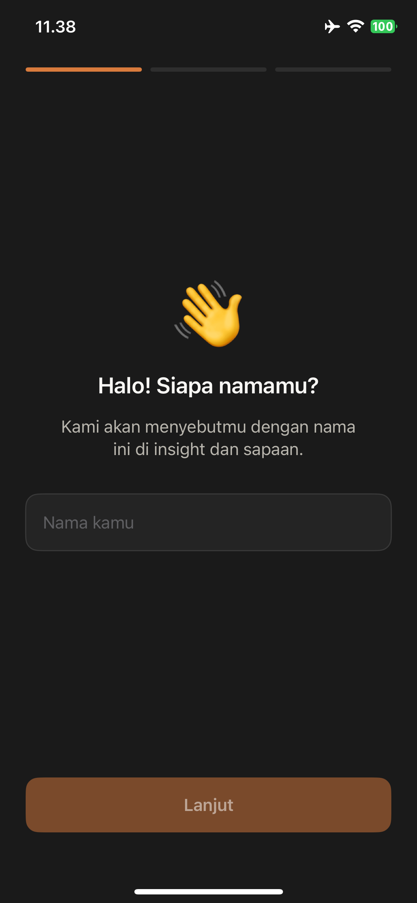<br />
      <sub><b>Onboarding 1</b></sub>
    </td>
    <td align="center" width="25%">
      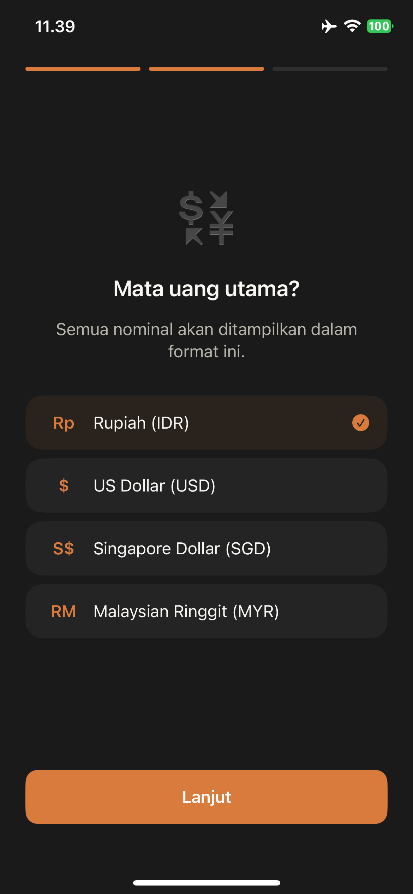<br />
      <sub><b>Onboarding 2</b></sub>
    </td>
    <td align="center" width="25%">
      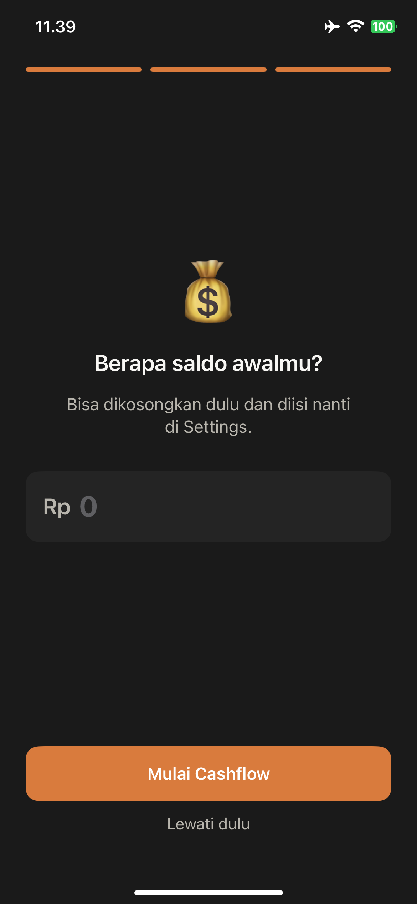<br />
      <sub><b>Security Lock</b></sub>
    </td>
    <td align="center" width="25%">
      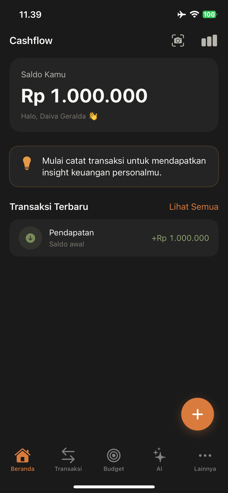<br />
      <sub><b>Dashboard Hub</b></sub>
    </td>
  </tr>
  <tr>
    <td align="center" width="25%">
      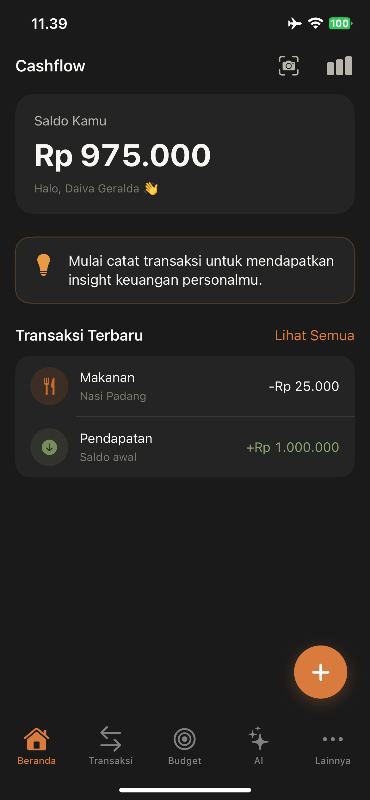<br />
      <sub><b>Transactions</b></sub>
    </td>
    <td align="center" width="25%">
      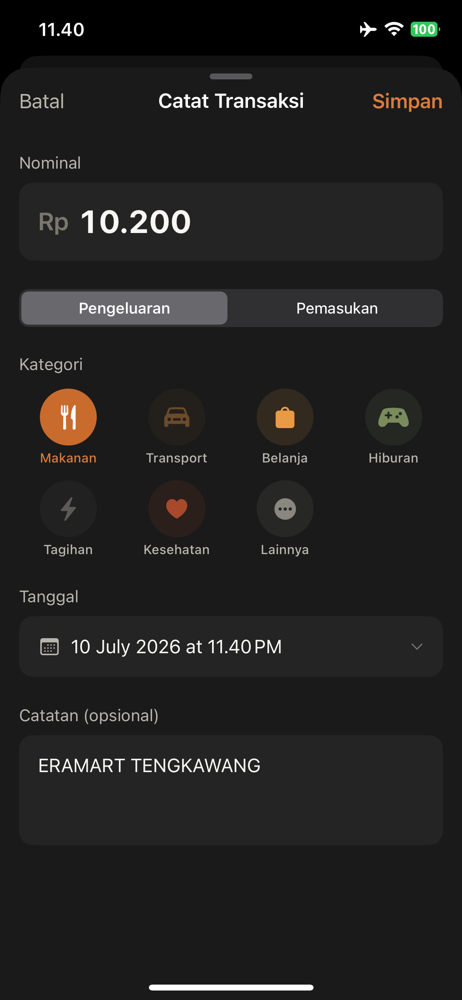<br />
      <sub><b>Budgets</b></sub>
    </td>
    <td align="center" width="25%">
      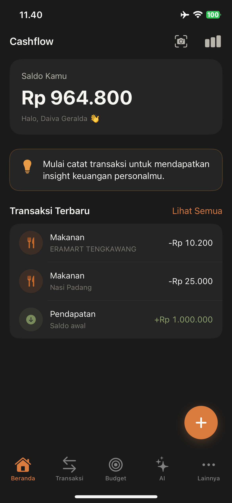<br />
      <sub><b>AI Advisor</b></sub>
    </td>
    <td align="center" width="25%">
      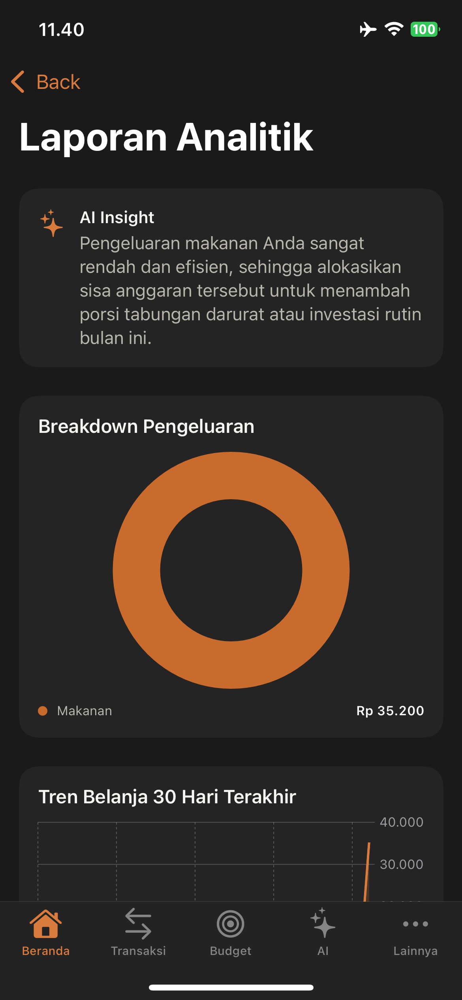<br />
      <sub><b>Bill Trackers</b></sub>
    </td>
  </tr>
  <tr>
    <td align="center" width="25%">
      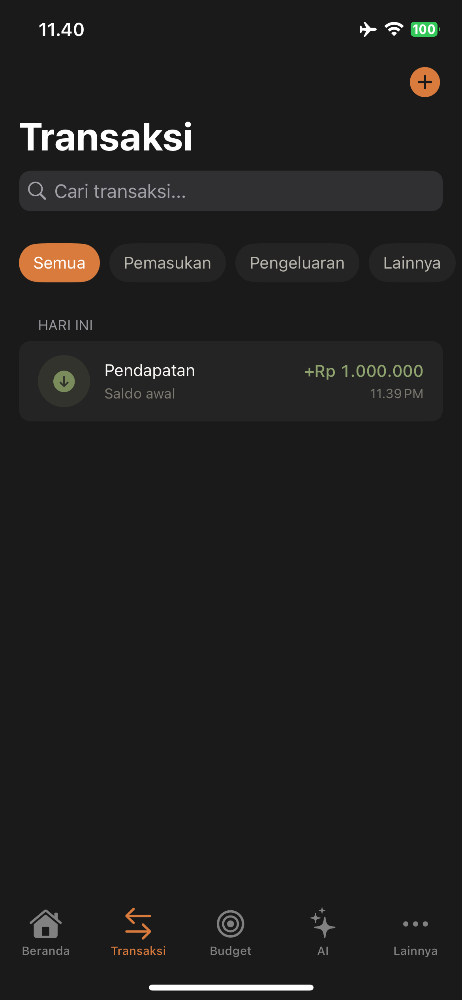<br />
      <sub><b>Spending Reports</b></sub>
    </td>
    <td align="center" width="25%">
      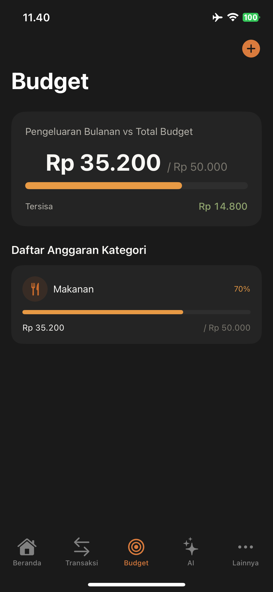<br />
      <sub><b>OCR Scanner</b></sub>
    </td>
    <td align="center" width="25%">
      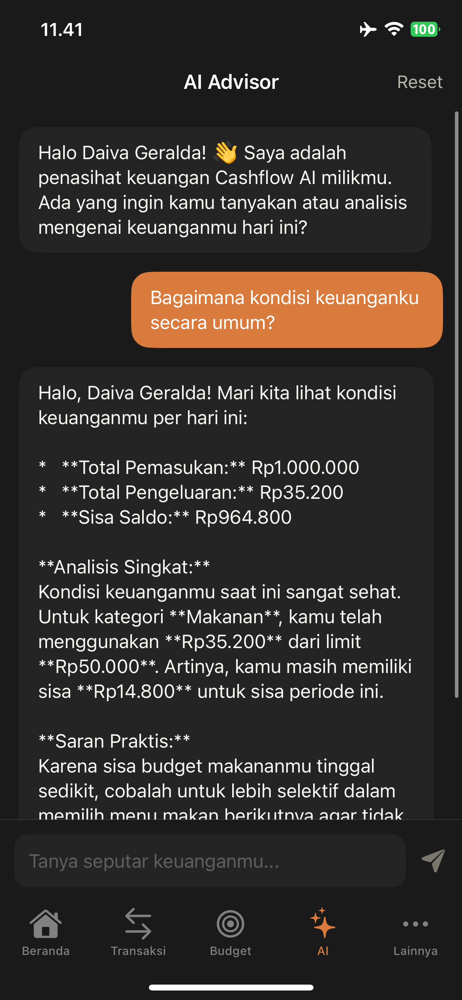<br />
      <sub><b>Active Widgets</b></sub>
    </td>
    <td align="center" width="25%">
      <br />
      <sub><b>Interactive Feed</b></sub>
    </td>
  </tr>
</table>

---

## Architecture

```
cashflow/
├── App/                        # App entry, root view, environment setup
├── Core/
│   ├── DesignSystem/
│   │   ├── Components/         # PrimaryButton, Cards, and reusable UI
│   │   └── Tokens/             # Color, Typography, Spacing, Radius tokens
│   ├── Persistence/            # CoreData stack + model definitions
│   │   └── Models/             # Transaction, Budget, Bill, Category
│   └── Services/               # Notification, OCR, Widget data bridge
├── Features/
│   ├── Auth/                   # Face ID lock screen + LocalAuthentication
│   ├── Onboarding/             # 3-page first-run flow
│   ├── Dashboard/              # Main hub — balance, AI insight, recent txns
│   ├── Transactions/           # List, add, edit, delete, OCR entry
│   ├── Budget/                 # Per-category budget with live progress
│   ├── Reports/                # Monthly charts & period comparisons
│   ├── AIAdvisor/              # Insight feed + Sumopod API integration
│   ├── Bills/                  # Recurring bill tracker + local notifications
│   ├── OCR/                    # Vision framework receipt scanner
│   └── Widgets/                # WidgetKit timeline provider + UI views
├── CashFlow Widget/            # Widget Extension target
└── docs/                       # Product strategy & design documentation
```

**Data layer:** CoreData with offline-first architecture. No account required. No server sync. Your financial data never leaves your device.

**Widget communication:** App Group (`group.com.dumeg.cashflow`) shared `UserDefaults` — the widget reads balance & budget data written by the main app on every transaction save, updated via WidgetKit timeline reload.

---

## Tech Stack

| Layer | Technology |
|---|---|
| Language | Swift 5.9 |
| UI Framework | SwiftUI |
| Persistence | Core Data |
| AI / Insights | Sumopod API (GPT-backed) |
| OCR | Vision + VisionKit |
| Widgets | WidgetKit |
| Notifications | UserNotifications |
| Auth | LocalAuthentication (Face ID / Touch ID) |
| Minimum iOS | iOS 17 |

---

## Design Philosophy

Cashflow's UI is built around **four constraints** every screen must satisfy:

1. **Scannable in < 3 seconds** — no critical information buried in submenus
2. **Calm color palette** — warm ambers, not alarm-red; information, not judgment
3. **No guilt language** — `"Category X is 18% higher than your 3-month average"` not `"You're overspending!"`
4. **Native feel** — follows Apple HIG conventions; feels like it shipped with the OS

The AI Advisor uses three escalation levels — *Informative*, *Cautionary*, *Important* — carried through tone and subtle color shifts. Never aggressive alerts, never panic red.

---

## Getting Started

### Prerequisites

- Xcode 15.4+
- iOS 17+ device or Simulator
- macOS Sonoma 14+

### Installation

```bash
# Clone the repo
git clone https://github.com/Daivageralda/cashflow.git
cd cashflow

# Open in Xcode
open cashflow.xcodeproj
```

> **Signing:** Open `Signing & Capabilities` on both the `cashflow` and `CashFlow WidgetExtension` targets. Select your personal team. Xcode handles provisioning automatically.

### Widget Setup

1. Select target `cashflow` → **Build Phases**
2. Verify `CashFlow WidgetExtension` exists under **Target Dependencies**
3. Verify **Copy Files** phase: Destination = `Plugins and Foundation Extensions`, `Code Sign On Copy` = ✅
4. Run `Cmd + R` — the widget will appear in the iOS Add Widget gallery

---

## Roadmap

```
MVP ──────────────── V1 (current) ─────────────────────── V2 (planned)
 │                        │                                     │
 ├─ Transaction tracking  ├─ OCR receipt scanning               ├─ Conversational AI chat
 ├─ Dashboard overview    ├─ Bills & reminders                  ├─ ML balance prediction
 ├─ Budget tracker        ├─ iOS Home Screen Widgets            ├─ iCloud Sync (CloudKit)
 ├─ Monthly reports       ├─ AI Advisor (rule-based)            ├─ Siri Shortcuts
 └─ Face ID lock          └─ Spending trend analysis            └─ CSV / PDF export
```

---

## License

MIT © [Daivageralda](https://github.com/Daivageralda)

---

<div align="center">

Built with ♥ in Swift — for people who care about their money without obsessing over it.


</div>
